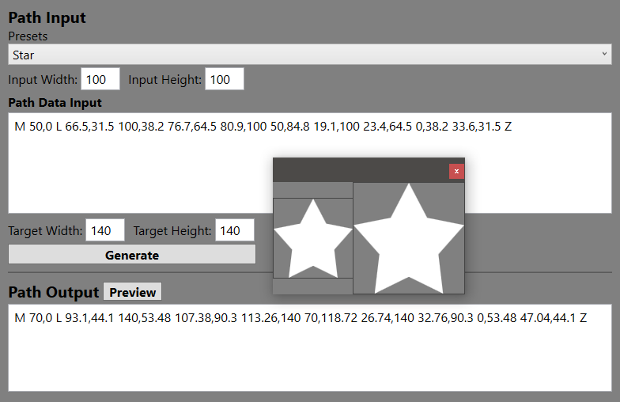

# WPF Path Markup Generator
Generate or resize WPF Path Markup data

### Problem
You create an awesome Path shape with Path Markup, but you realize that you made the shape too small or too large.

### Solution
WPF Path Markup Generator takes your markup input, parses it, and resizes it to whatever dimensions you require.

### Limitations
* Arcs with `rotationAngle` set to anything other than 0 or 180 produce unpredictable results if the reference and target aspect ratios are not the same. For example, if the Path Input dimensions are 100x100, then all arcs will work fine for target dimensions that are square (200x200, 754x754, 1400x1400, etc.) but entering a non-square aspect ratio (200x300, 1x1500, 99x100, etc.) may produce unpredictable results if the `rotationAngle` is not set to 0 or 180.

* Path input needs to be formatted quite specifically. Look at the Path Input of some of the presets for reference.